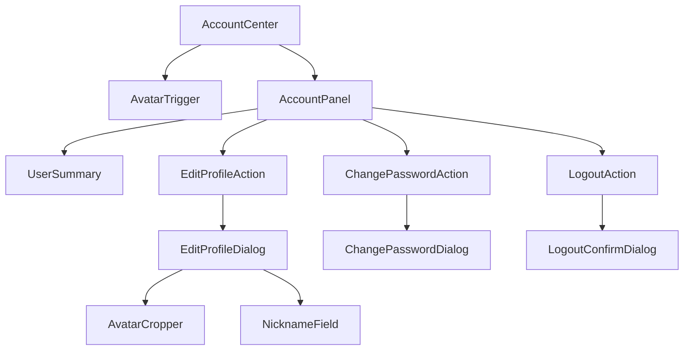

# 用户中心信息卡片 DESIGN

| 项目 | 内容 |
| --- | --- |
| 文档版本 | v1.0 |
| 文档状态 | 待产品与设计评审 |
| 设计基线 | 仓库根目录 `DESIGN.md` |
| 适用组件 | `@innerfire/auth-center-react` |
| 视觉方向 | Notion 风格、暖中性、低噪声、轻边界 |
| 最后更新 | 2026-07-30 |

## 1. 设计目标

用户中心应是一个轻量、克制且可信赖的账户入口：

- 不抢占业务页面注意力；
- 用户能快速确认当前身份；
- 编辑资料、修改密码和退出具有清晰层级；
- 敏感操作有足够反馈但不过度打断；
- 桌面与移动端保持一致的信息结构；
- 宿主只能配置主题色和头像大小，避免公司产品间发生视觉分叉。

本文档是视觉与交互规格来源。评审通过前，当前代码属于候选实现，需要在评审后按本文档重新核对。

## 2. 设计原则

1. **暖中性**：使用暖白、暖灰和近黑，不使用蓝灰色大面积铺底。
2. **低噪声**：边框和阴影只用于建立层级，不使用厚重描边。
3. **内容优先**：卡片首先回答“我是谁”，其次才展示操作。
4. **固定结构**：菜单项、间距、圆角、断点和弹层尺寸不允许宿主改写。
5. **安全感**：密码和退出操作具有明确确认、Loading 和结果反馈。
6. **可访问**：所有交互支持键盘、可见焦点和至少 44×44px 热区。

## 3. 组件结构

## 4. Design Tokens

### 4.1 颜色

| Token | 默认值 | 用途 |
| --- | --- | --- |
| `color-primary` | `#0075de` | 焦点、主按钮、头像强调环。 |
| `color-primary-active` | `#005bab` | 主按钮按下态。 |
| `color-surface` | `#ffffff` | Popover、Modal、Drawer 表面。 |
| `color-surface-muted` | `#f6f5f4` | Hover、头像占位和局部弱背景。 |
| `color-text` | `rgba(0,0,0,0.95)` | 主要文本。 |
| `color-text-secondary` | `#615d59` | 次要信息与说明。 |
| `color-text-muted` | `#a39e98` | 占位和禁用文本。 |
| `color-border` | `rgba(0,0,0,0.1)` | 卡片、分隔线和输入框边界。 |
| `color-focus` | `#097fe8` | 键盘焦点环。 |
| `color-danger` | `#d92d20` | 退出和错误状态。 |
| `color-danger-hover` | `#b42318` | 危险操作 Hover。 |
| `color-success` | `#1aae39` | 成功反馈。 |

`themeColor` 仅替换 `color-primary` 及其可计算的交互状态，不改变危险色、文本色或背景色。

主题色仅接受 `#RRGGBB`。无法通过对比度要求时回退 `#0075de`。

### 4.2 字体

字体继承宿主统一字体栈：

`Inter, -apple-system, system-ui, "Segoe UI", Helvetica, Arial, sans-serif`

| 角色 | 字号 | 字重 | 行高 |
| --- | --- | --- | --- |
| 用户昵称 | 14px | 600 | 20px |
| 菜单项 | 14px | 500 | 20px |
| Dialog 标题 | 16px | 600 | 24px |
| 字段标签 | 14px | 500 | 20px |
| 正文 | 14px | 400 | 20px |
| 辅助说明 | 12px | 400 | 16px |
| 错误文案 | 12px | 400 | 16px |

昵称单行省略，不换行。

### 4.3 间距

| Token | 值 | 用途 |
| --- | --- | --- |
| `space-1` | 4px | 图标微间距、错误文案上边距。 |
| `space-2` | 8px | 小型内部间距。 |
| `space-3` | 12px | 头像与文本、菜单分组。 |
| `space-4` | 16px | 卡片水平内边距、表单间距。 |
| `space-5` | 20px | Dialog 内容区垂直间距。 |
| `space-6` | 24px | Header 左右内边距。 |

### 4.4 圆角与边界

| 元素 | 圆角 | 边框 |
| --- | --- | --- |
| 头像 | 50% | 可选 2px 主题色焦点环。 |
| 触发按钮 | 6px | 默认透明。 |
| 菜单项 | 5px | 无。 |
| Popover | 10px | 1px `color-border`。 |
| Modal | 12px | 1px `color-border`。 |
| Bottom Sheet | 16px 16px 0 0 | 顶部 1px 弱边界。 |
| 输入框/按钮 | 4px | 1px `color-border`。 |
| 裁剪区 | 8px | 1px `color-border`。 |

### 4.5 阴影

Popover 使用轻量四层阴影：

`0 4px 18px rgba(0,0,0,0.04), 0 2px 8px rgba(0,0,0,0.027), 0 1px 3px rgba(0,0,0,0.02)`

Modal 和 Bottom Sheet 使用更深但低透明度阴影：

`0 14px 28px rgba(0,0,0,0.04), 0 23px 52px rgba(0,0,0,0.05)`

不使用发光、玻璃拟态或高饱和渐变。

## 5. Avatar Trigger

### 5.1 尺寸

- 默认头像：32×32px；
- 可配置范围：24–96px 的整数；
- 点击区域：最小 44×44px；
- 头像始终圆形裁切；
- 头像图片使用 `object-fit: cover`。

### 5.2 状态

| 状态 | 视觉 |
| --- | --- |
| Default | 透明按钮，圆形头像。 |
| Hover | 暖灰背景 `color-surface-muted`。 |
| Active | 暖灰背景加深 2–4%。 |
| Focus-visible | 2px `color-focus` 外环，offset 2px。 |
| Loading | 固定占位头像，不改变布局。 |
| Image error | 切换统一占位头像，不显示破图。 |
| Disabled | 入口本身不禁用；退出能力始终保留。 |

触发按钮可访问名称固定为“账户菜单”，并设置 `aria-haspopup`、`aria-expanded`。

## 6. Desktop Popover

### 6.1 布局

- 定位：头像入口下方，右边缘对齐；
- 宽度：240px；
- 最大宽度：`calc(100vw - 32px)`；
- 表面：纯白；
- 圆角：10px；
- 内边距：顶部/底部 4px；
- z-index：高于页面内容和常规 Dropdown，低于 Modal。

### 6.2 用户摘要区

- 高度：64px；
- 内边距：12px 16px；
- 头像：40×40px；
- 头像与昵称间距：12px；
- 昵称最大宽度：156px；
- 底部 1px 分隔线。

状态文案：

- 加载：`加载中…`
- 获取失败：`未获取到用户信息`

### 6.3 菜单项

- 固定顺序：编辑资料、修改密码、分隔线、退出系统；
- 高度：44px；
- 水平内边距：16px；
- 图标与文本间距：10px；
- 图标：16px；
- Hover：`color-surface-muted`；
- Active：背景略深并保持文本不位移；
- 退出系统使用危险色，但不使用大面积红色背景。

## 7. Mobile Bottom Sheet

断点固定为 `<768px`，不允许通过 Props 修改。

- 宽度：100%；
- 最大高度：80dvh；
- 顶部圆角：16px；
- 底部内边距：`max(16px, env(safe-area-inset-bottom))`；
- 带半透明遮罩；
- 打开时锁定页面滚动；
- 用户摘要区和操作顺序与桌面一致；
- 菜单项高度保持 48px，便于触控；
- 支持向下关闭由 Ant Design Drawer 能力决定，本期不要求自定义手势。

## 8. 编辑资料 Dialog

### 8.1 桌面

- Modal 宽度：480px；
- 内容内边距：24px；
- 标题：`编辑资料`；
- 底部按钮：左侧取消、右侧保存；
- 保存为主按钮。

### 8.2 移动

- Bottom Drawer 高度：80dvh；
- 内容区可滚动；
- 保存按钮固定在底部 safe-area 上方；
- 保存按钮占满可用宽度。

### 8.3 资料布局

- 头像预览：64×64px；
- “更换头像”按钮位于头像右侧；
- 昵称字段位于头像区下方，间距 20px；
- 错误文案紧邻字段下方；
- 能力关闭时更换头像按钮禁用，并通过 title/辅助文案说明“头像上传能力尚未启用”。

## 9. Avatar Cropper

- Dialog 宽度：420px；
- 裁剪视口：桌面 320×320px；移动端使用可用宽度，最大 320px 高；
- 背景：暖灰；
- 遮罩：`rgba(0,0,0,0.45)`；
- 裁剪区域：居中圆形预览，但输出为 1:1 正方形；
- 缩放范围：0.5–3；
- 缩放步长：0.01；
- 支持鼠标、触控笔和触摸拖动；
- 按钮：取消、确认裁剪；
- 未选择图片时确认按钮禁用；
- 裁剪期间确认按钮显示 Loading。

文件提示固定为：`支持 JPG / PNG，文件 ≤ 2 MiB`。

## 10. 修改密码 Dialog

- 桌面 Modal 宽度：480px；
- 移动 Drawer 高度：80dvh；
- 字段顺序：原密码、新密码、确认新密码；
- 字段垂直间距：16px；
- 密码默认隐藏，可使用 Ant Design 的显示切换；
- 校验错误在字段组下方展示；
- 提交期间确认按钮 Loading 并禁用重复提交；
- 成功 Toast：`密码已修改，请重新登录`。

不显示密码强度分数，本期只显示规则校验结果。

## 11. 退出确认

- 标题：`确认退出`；
- 正文：`确定要退出系统吗？`；
- 按钮：取消、退出；
- 默认焦点：取消；
- 退出按钮使用危险文本/边界，不使用主主题色；
- 提交后按钮 Loading，遮罩和 `Esc` 不得触发重复请求。

## 12. 反馈状态

| 场景 | 反馈 |
| --- | --- |
| 资料保存成功 | Toast：`资料已更新`。 |
| 资料保存失败 | 保持 Dialog 打开，显示服务端安全错误。 |
| 头像格式错误 | Toast：`仅支持 JPG / PNG 格式`。 |
| 头像超限 | Toast：`文件大小不能超过 2 MiB`。 |
| 密码成功 | Toast 后进入退出流程。 |
| 密码失败 | 保留表单并显示错误，不清空输入。 |
| 用户资料失败 | 占位头像 + `未获取到用户信息`。 |
| 退出失败 | 导航到服务端兼容退出路由。 |

Loading 不使用布局跳动；按钮宽度保持不变。

## 13. 动效

| 元素 | 动画 | 时长 | Easing |
| --- | --- | --- | --- |
| Popover | opacity + translateY(4px→0) | 150ms | ease-out |
| Bottom Sheet | translateY(100%→0) | 200ms | cubic-bezier(0.2,0.8,0.2,1) |
| Modal | opacity + scale(0.98→1) | 180ms | ease-out |
| Hover | background-color | 120ms | ease-out |
| Loading | Ant Design Spinner | 系统默认 | linear |

当 `prefers-reduced-motion: reduce` 时：

- 移除位移和缩放；
- opacity 过渡缩短到不超过 80ms；
- 保留必要的 Loading 状态反馈。

## 14. 响应式

| 视口 | 用户卡片 | 编辑资料 | 修改密码 | 裁剪 |
| --- | --- | --- | --- | --- |
| ≥1024px | 240px Popover | 480px Modal | 480px Modal | 420px Modal |
| 768–1023px | 240px Popover | 480px Modal | 480px Modal | 420px Modal |
| <768px | Bottom Sheet | 80dvh Drawer | 80dvh Drawer | 适配屏宽的 Dialog/Drawer |
| <400px | 全宽 Sheet | 减少水平内边距至16px | 减少水平内边距至16px | 裁剪区按屏宽缩放 |

## 15. 可访问性

- 触发器使用 `<button type="button">`；
- 触发器包含 `aria-haspopup`、`aria-expanded` 和可访问名称；
- 菜单容器使用 `role="menu"`，操作项使用 `role="menuitem"`；
- Modal/Drawer 有可关联标题；
- 错误使用 `role="alert"`；
- Loading 使用 `aria-live="polite"`；
- 焦点环不依赖颜色变化之外的单一提示；
- 所有文本与背景达到 WCAG AA；
- 头像 `` 使用空 alt，由触发按钮提供语义；资料区域需要说明时使用“用户头像”；
- 关闭弹层后焦点返回打开它的元素；
- 任一时刻只允许一个有效焦点陷阱。

## 16. CSS-in-JS 约束

- 样式必须由包自身的 CSS-in-JS 或 Ant Design token 生成；
- 不依赖宿主 Tailwind class 才能正确显示；
- 不输出全局选择器；
- 不修改宿主 `body` 之外的全局样式；移动 Drawer 打开时仅使用框架滚动锁；
- 动态样式只允许使用 `themeColor` 和 `avatarSize`；
- 不导出 `className`、`style`、slot、menu items、breakpoint 或 endpoint 配置。

## 17. 设计验收清单

- [ ] 桌面 Popover 与入口右边缘对齐，无遮挡。
- [ ] 移动 Bottom Sheet 考虑 safe-area 和页面滚动锁。
- [ ] 头像为空、破图和 Loading 均无布局跳动。
- [ ] 昵称超长时单行省略。
- [ ] 编辑资料在头像能力关闭时仍可修改昵称。
- [ ] 头像裁剪支持拖动和缩放，输出与预览一致。
- [ ] 密码和退出提交期间不能重复触发。
- [ ] 外部点击、`Esc` 和再次点击入口可关闭用户卡片。
- [ ] 所有关闭路径都恢复焦点。
- [ ] 主题色与头像尺寸非法时回退默认值。
- [ ] 浅色页面、暖灰页面、长昵称和小屏均完成视觉回归。
- [ ] `prefers-reduced-motion` 下无不必要位移动画。

## 18. 待评审项

1. Popover 最终宽度采用 240px 还是 256px；当前建议 240px。
2. 头像裁剪在移动端采用 Modal 还是独立 Bottom Sheet；当前建议独立 Bottom Sheet。
3. 用户资料加载失败时是否增加显式重试按钮。
4. 修改密码能力关闭时隐藏菜单还是禁用并显示原因；当前建议隐藏。
5. 是否将退出危险色固定为 `#d92d20`，或沿用 Ant Design danger token。
