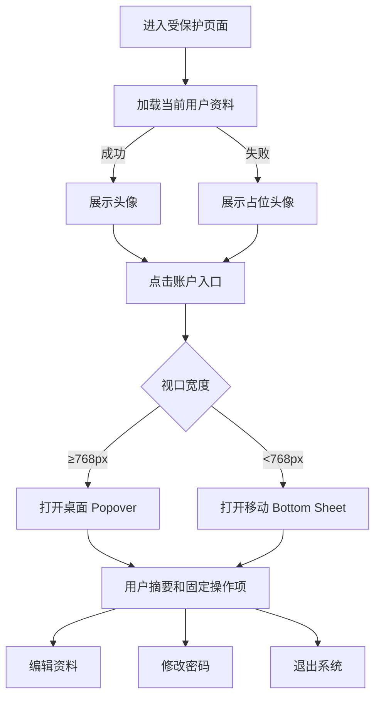
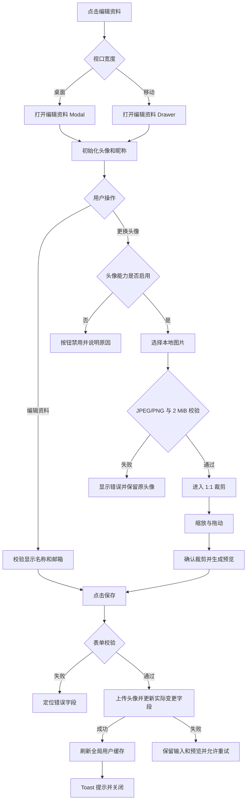
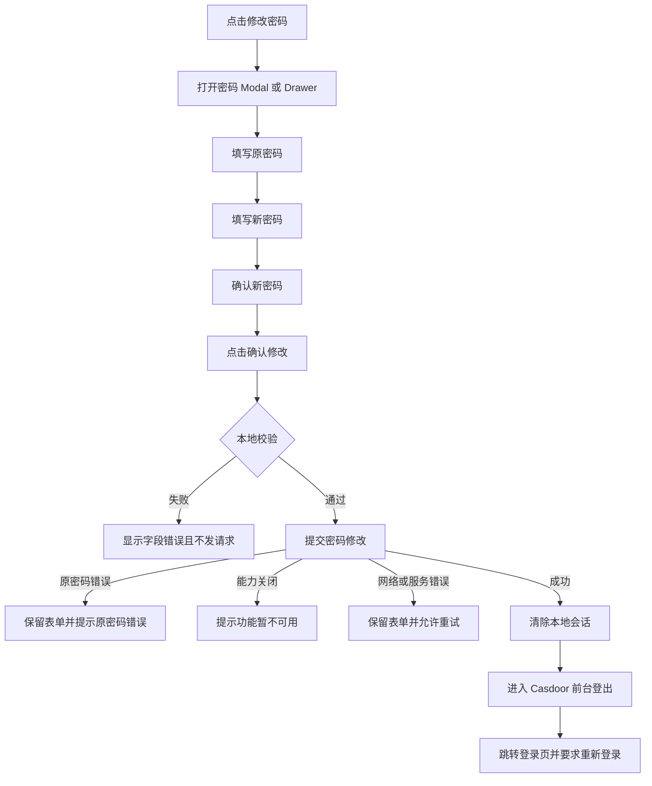
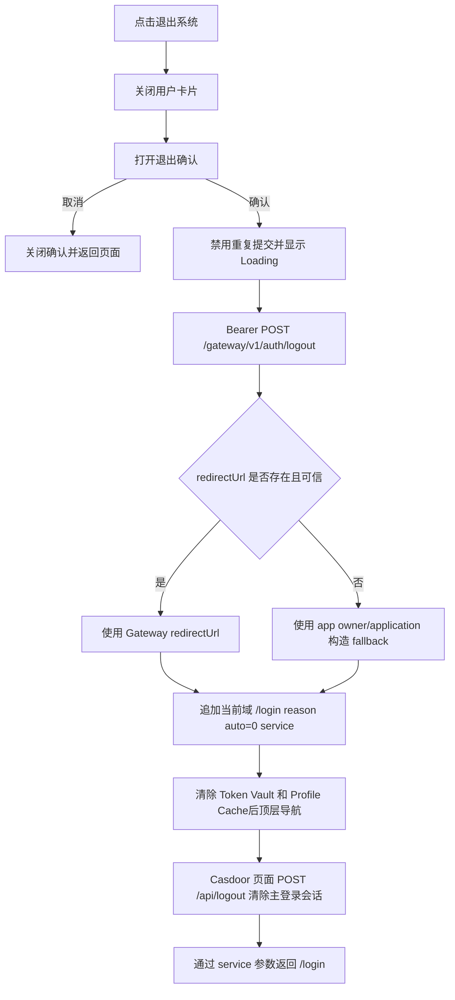

# 用户中心信息卡片 UIFLOW

| 项目 | 内容 |
| --- | --- |
| 文档版本 | v1.0 |
| 文档状态 | 待产品与设计评审 |
| 对应需求 | `.vibeRig/requirements/account-center-card/requirement.md` |
| 适用组件 | `@innerfire/auth-center-react` |
| 首期接入 | `apps/app` |
| 最后更新 | 2026-07-30 |

## 1. 目标

定义用户中心信息卡片从入口、浏览、编辑到退出的完整交互流程，明确桌面端与移动端差异、异步状态、错误恢复和焦点行为。

本文档是交互事实来源。评审通过前，现有实现仅作为候选，不代表最终交互验收通过。

## 2. 入口与页面范围

入口位于受保护页面顶部导航区域右侧，当前覆盖：

- `/`
- `/chat/**`
- `/profile/**`

`/login` 不展示入口。

入口默认使用用户头像；用户资料加载前、头像为空或头像加载失败时使用统一占位头像。入口点击区域始终不小于 44×44px。

## 3. 总体页面流

## 4. 用户卡片流程

### 4.1 打开

1. 用户点击头像入口。
2. 系统根据视口选择展示形态：
   - 桌面端：头像下方右对齐 Popover。
   - 移动端：页面底部 Bottom Sheet，带遮罩和 safe-area。
3. 展示头像、昵称和固定操作项。
4. 初始焦点进入第一个可操作菜单项。

### 4.2 关闭

以下行为关闭当前用户卡片：

- 再次点击头像入口；
- 点击浮层或抽屉外部；
- 按 `Esc`；
- 选择任一操作项；
- 路由发生变化。

关闭后焦点返回头像入口。

### 4.3 用户资料状态

| 状态 | 头像入口 | 卡片摘要 | 可用操作 |
| --- | --- | --- | --- |
| Loading | 占位头像 | `加载中…` | 允许退出；资料操作等待数据 |
| Success | 用户头像或占位头像 | 昵称 | 按 capability 展示或禁用 |
| Empty | 占位头像 | `未获取到用户信息` | 允许重试与退出 |
| Error | 占位头像 | `未获取到用户信息` | 允许重试与退出 |
| Unauthenticated | 关闭敏感浮层 | 不展示 | 进入登录流程 |

## 5. 编辑资料流程

### 5.1 昵称规则

- 必填；
- 提交前执行 Unicode NFC 归一化和首尾空格清理；
- 编辑界面仅展示显示名称与邮箱；显示名称最多 100 个 Unicode 字符，允许空字符串清空；
- 允许中文、拉丁字符、数字、内部空格和 Emoji；
- 校验失败不发送请求。

### 5.2 头像规则

- 支持 `image/jpeg`、`image/png`、`image/webp`；
- 原始文件最大 2 MiB；
- 选择成功后必须进入 1:1 裁剪；
- 支持拖动和缩放；
- 裁剪结果为正方形图片；
- 上传失败不得覆盖原头像；
- 服务端能力关闭时，仍允许编辑昵称。

### 5.3 取消与关闭

点击取消、关闭按钮、遮罩或 `Esc` 时：

- 直接丢弃未保存的昵称和头像草稿；
- 不显示二次确认；
- 不调用更新接口；
- 再次打开时从最新已保存资料初始化。

### 5.4 保存顺序

当昵称和头像同时修改时：

1. 前端完成全部本地校验；
2. 先上传裁剪后的头像；
3. 头像上传成功后提交实际变化的资料字段；
4. 任一步失败均保持编辑面板打开；
5. 成功后刷新共享用户缓存，使所有入口同步更新。

头像上传成功但昵称更新失败属于部分成功风险；UI 必须重新获取服务端资料，不得显示虚假的整体成功状态。

## 6. 修改密码流程

### 6.1 密码规则

- 原密码必填；
- 新密码必填，长度 8–128；
- 新密码至少包含一个 ASCII 字母和一个数字；
- 新密码不得与原密码相同；
- 确认新密码必须与新密码一致；
- 提交期间禁用重复操作。

### 6.2 成功语义

密码修改成功后必须重新登录：

1. DirectGatewayAdapter 收到 Gateway 204；
2. Zustand Token Vault 和 Profile Cache 立即清空；
3. 用户进入 `/login` 并重新完成 PKCE 登录。

## 7. 退出系统流程

退出确认默认焦点放在“取消”，降低误触风险。

## 8. Capability 降级流程

`AccountCenterProvider` 通过配置提供：

- `capabilities.avatarUpload`
- `capabilities.passwordChange`
- `degradedReasons`

交互规则：

| 能力 | `false` 时的行为 |
| --- | --- |
| 头像上传 | 编辑资料仍可打开；更换头像按钮禁用并说明原因；昵称仍可保存。 |
| 修改密码 | 显示禁用的“修改密码”菜单项并说明原因。 |
| 用户资料获取 | 展示占位头像和失败文案，保留退出能力。 |

Capability 由宿主在 `AccountCenterProvider` 中配置；Gateway 仍必须独立执行服务端授权和能力校验。

## 9. 并发与重复操作

- 资料请求由 TanStack Query 按固定 query key 去重。
- 保存资料、上传头像、修改密码和退出期间按钮进入 Loading 并禁止重复提交。
- 成功更新后直接写入用户缓存，并按需重新获取服务端资料。
- 退出开始后不接受迟到的用户资料响应覆盖已清理状态。

## 10. 键盘与焦点流

### 桌面端

1. `Tab` 聚焦头像入口；
2. `Enter` 或 `Space` 打开 Popover；
3. 焦点进入第一个菜单项；
4. 方向键或 `Tab` 在菜单项之间移动；
5. `Enter` 执行操作；
6. `Esc` 关闭当前层；
7. 关闭后焦点返回入口。

### 移动端

- Bottom Sheet 打开后锁定页面滚动；
- 焦点限制在当前 Sheet 内；
- 遮罩点击或 `Esc` 关闭；
- Modal/Drawer 不允许同时形成两个有效焦点陷阱。

## 11. 待评审项

- 编辑资料中头像上传成功、昵称更新失败时的最终产品提示文案；
- 是否在用户卡片摘要区增加显式“重试”按钮；
- 修改密码能力关闭时采用隐藏菜单还是禁用菜单；当前建议隐藏；
- 真实 Casdoor 测试环境中的头像上传响应和旧密码错误映射。
